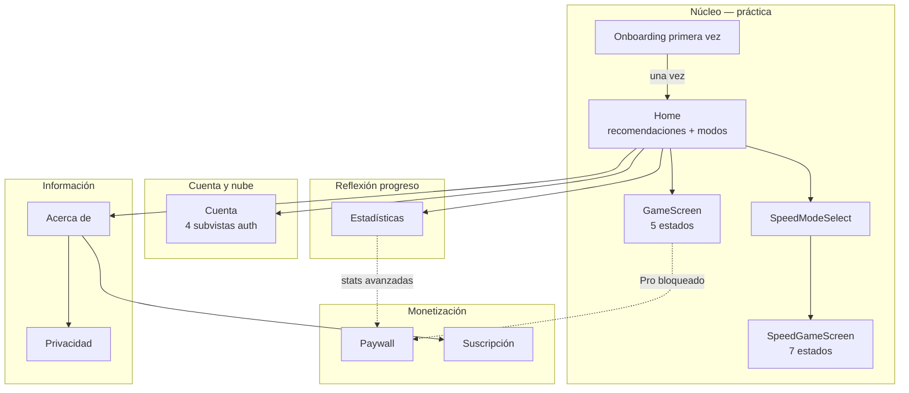

# TOGESC — Arquitectura de la información y diseño GUI

**Producto:** Entrenador de Oído Absoluto (TOGESC)  
**Versión app:** 1.0.0+1  
**Referencia técnica:** [system_design.md](system_design.md)

Este documento inventaría **todas las vistas y superficies de UI** que la aplicación requiere por su naturaleza (entrenamiento SRS + audio en cliente), distinguiendo:

- **Pantalla** — ruta GoRouter o `Scaffold` de pantalla completa  
- **Estado interno** — subvista dentro de una pantalla (sin ruta propia)  
- **Superficie flotante** — diálogo, banner, snackbar, guard de carga  
- **Componente embebido** — card, teclado, campo; no es vista navegable  

Leyenda: ✅ implementado en código · ⚠️ requerido por naturaleza pero ausente o externo al app

---

## 1. Principio organizador (IA)

La app no se organiza como un menú de ajustes con “juego” como ítem más. El **eje dominante** es el **bucle de entrenamiento auditivo** sobre 12 clases de altura (`NoteData` × C, C# … B):

```
Recomendación SRS → elegir modo → ronda (oír → responder → feedback → cluster) → SRS actualizado
```

Todo lo demás (cuenta, Pro, estadísticas, acerca de) es **satélite** del hub de práctica (`HomeScreen`). El README abre con SRS, octavas, timbres y cluster; la IA refleja ese peso: **Home + Game** ocupan el centro del mapa.



---

## 2. Mapa de rutas (`AppRoutes`)

| Ruta | Pantalla | Archivo | Acceso habitual |
|------|----------|---------|-----------------|
| `/onboarding` | Cómo funciona | `onboarding_screen.dart` | Redirect si `togesc_onboarding_complete` ≠ true |
| `/` | Home | `home_screen.dart` | Hub principal |
| `/game/:modeId` | Juego por modo | `game_screen.dart` | Desde tarjeta de modo; guard `ProRouteGuard` |
| `/speed` | Selector modo velocidad | `speed_mode_select_screen.dart` | Pro; desde Home |
| `/speed/game/:modeId` | Juego velocidad | `speed_game_screen.dart` | Tras selector |
| `/statistics` | Estadísticas | `statistics_screen.dart` | AppBar Home |
| `/account` | Cuenta y sincronización | `account_screen.dart` | AppBar Home |
| `/paywall` | TOGESC Pro | `paywall_screen.dart` | Modo Pro bloqueado, banner cuenta, stats |
| `/subscription` | Suscripción | `subscription_screen.dart` | Acerca de |
| `/about` | Acerca de TOGESC | `about_screen.dart` | AppBar Home |
| `/privacy` | Política de privacidad | `privacy_policy_screen.dart` | Acerca de |

**No hay** en el código actual: `Drawer`, `NavigationRail`, `BottomNavigationBar`, `TabBar` principal, ni `PopupMenu` / `DropdownButton` de navegación global.

---

## 3. Pantallas completas — detalle

### 3.1 Onboarding (`/onboarding`) ✅

| Elemento | Contenido real |
|----------|----------------|
| Título AppBar | `Como funciona` |
| H1 | `Bienvenido al entrenador de oido absoluto` |
| Bloques | 3 × `PedagogySectionCard`: SRS, octavas/timbres, limpieza tonal |
| CTA | `Entendido, empezar` → marca preferencia + `context.go(/)` |

### 3.2 Home (`/`) ✅ — **vista dominante**

| Zona | Componente | Condición |
|------|------------|-----------|
| AppBar título | `Entrenador de Oido Absoluto` | siempre |
| AppBar acciones | Pro (si !hasPro), Cuenta, Acerca de, Estadísticas | iconos + tooltips |
| Cuerpo superior | `RecommendationCard` | si `getPracticeRecommendations()` no vacío |
| Sección | `Modos de Juego` (H2, 20 bold) | siempre |
| Lista | 6 × `_ModeCard` | ver tabla modos |

**Modos en Home** (título / subtítulo / color / Pro):

| Modo | Título UI | Subtítulo | Color | Pro |
|------|-----------|-----------|-------|-----|
| Una nota | Una sola nota | Identifica notas individuales | green | — |
| Intervalo | Intervalo (2 notas) | Identifica dos notas simultaneas | orange | — |
| Acorde | Acorde (3 notas) | Identifica tres notas simultaneas | deepOrange | PRO |
| Aleatorio | Aleatorio (1-5 notas) | Numero aleatorio de notas | purple | PRO |
| Sostenidos | Solo sostenidos | C#, D#, F#, G#, A# | blue | — |
| Velocidad | Entrenamiento de velocidad | Responde antes de que se agote el tiempo | red | PRO |

Tarjeta Pro bloqueada: badge `PRO`, trailing `lock_outline`, tap → paywall con query `feature`.

### 3.3 GameScreen (`/game/:modeId`) ✅

**AppBar:** `mode.displayName` + acción timbre (`tooltip`: `Timbre aleatorio` / `Onda senoidal`).

**Estados internos** (`GameState`) — misma ruta, contenido intercambiable:

| Estado | Vista interna | UI clave |
|--------|---------------|----------|
| `idle` | Preparación | Icono auriculares, `Preparate para escuchar`, botón `Reproducir` |
| `listening` | Escucha | `Escucha atentamente... (N nota(s))`, `CircularProgressIndicator` |
| `waitingForAnswer` | Respuesta | Piano + chips selección + `Confirmar` / `Repetir` + `NoteInputField` |
| `showingResult` | Resultado | Piano deshabilitado (verde/rojo) + `ResultCard` + barra `Siguiente` |
| `playingCluster` | Limpieza | `Limpiando el oido...`, ondas, progress |

### 3.4 SpeedModeSelect (`/speed`) ✅

| Elemento | Texto |
|----------|-------|
| AppBar | `Velocidad - Elige modo` |
| H1 | `Que modo quieres practicar?` |
| Ayuda | `El tiempo limite disminuira con cada respuesta correcta.` |
| Opciones | 5 × `_SpeedModeOption` (mismos títulos que modos estándar) |

### 3.5 SpeedGameScreen (`/speed/game/:modeId`) ✅

**Barra fija:** chips `Racha`, `Limite`, `Promedio` (si hay datos).

**Estados internos** (`SpeedState`):

| Estado | Vista |
|--------|-------|
| `idle` | `Modo Velocidad`, tiempo inicial 10s, `Comenzar` |
| `playing` | Escucha + progress |
| `waitingForAnswer` | `CountdownTimerWidget` + piano + confirmar |
| `correct` | `CORRECTO!`, nuevo límite |
| `incorrect` | Feedback error |
| `timeout` | Tiempo agotado |
| `gameOver` | Fin de sesión velocidad |

### 3.6 Statistics (`/statistics`) ✅

| Bloque | Contenido |
|--------|-----------|
| Loading | `CircularProgressIndicator` centrado |
| Resumen | Precisión global, total intentos, en aprendizaje, consolidadas, pendientes revisión |
| Progreso | `LinearProgressIndicator` + `N de 12 notas consolidadas` |
| Free | Card `Estadisticas avanzadas (Pro)` → paywall |
| Pro | Secciones `Notas Mas Dificiles` / `Mas Faciles` (chips) |
| Pro | `Exportar progreso (CSV)` |
| Siempre | `Reiniciar progreso` (rojo) → diálogo confirmación |

### 3.7 Account (`/account`) ✅ — máquina de subvistas

**Siempre visible arriba:** `PracticeSettingsSection` (card preferencias).

**Subvistas** (`_AccountView` + condiciones) — una sola pantalla, contenido mutuamente excluyente:

| Subvista | Cuándo | Campos / acciones |
|----------|--------|-------------------|
| Supabase no configurado | `!supabaseAvailable` | Icono `cloud_off`, texto entrenamiento local |
| Nueva contraseña | recovery / `updatePassword` | Campo contraseña, `Guardar contrasena` |
| Sesión iniciada | `signedIn` | Avatar + email, `SyncDiagnosticsCard`, banners, sync, cerrar sesión |
| Recuperar contraseña | `forgotPassword` | Email, `Enviar enlace`, volver |
| Iniciar sesión | default | Email + contraseña, `Entrar`, enlaces registro / olvidé |
| Crear cuenta | `signUp` | Igual + `Crear cuenta` |

**Preferencias embebidas** (`PracticeSettingsSection`):

| Control | Tipo | Etiqueta |
|---------|------|----------|
| Solfeo | `SwitchListTile` | `Notacion Do/Re/Mi` |
| Recordatorios | `SwitchListTile` | `Recordatorios de repaso` (solo Android/iOS) |

### 3.8 Paywall (`/paywall?feature=`) ✅

Modal de pantalla completa con cierre (`Icons.close`). Título dinámico: `Desbloquea {feature}` o `Pasa a TOGESC Pro`. Lista features: acordes/aleatorio/velocidad, sync nube, stats avanzadas. Botones (si monetización activa): `Suscribirme`, `Probar 14 dias gratis`, `Restaurar compras`.

### 3.9 Subscription (`/subscription`) ✅

Plan `Gratis` / `Pro`, estado prueba, `Ver planes Pro`, `Gestionar pago (Stripe)` web o `Restaurar compras` móvil.

### 3.10 About (`/about`) ✅

Pedagogía + `ListTile` navegables: Suscripción Pro, Cuenta, Privacidad.

### 3.11 Privacy (`/privacy`) ✅

Texto legal estático (política publicada en app).

---

## 4. Superficies flotantes y transitorias

### 4.1 Diálogos modales (`AlertDialog`) ✅

| Diálogo | Disparador | Título | Acciones |
|---------|------------|--------|----------|
| Reiniciar progreso | Estadísticas | `Reiniciar progreso?` | `Cancelar` / `Reiniciar` (rojo) |
| Encuesta CSAT | `CsatSurveyListener` tras 10 sesiones | `Como va tu experiencia?` | Estrellas 1–5, comentario opcional, `Ahora no` / `Enviar` |

Archivos: `statistics_screen.dart`, `csat_survey_dialog.dart`.

### 4.2 MaterialBanner (inline, no flotante) ✅

Solo en **Cuenta** cuando sesión iniciada:

| Banner | Texto | Acción |
|--------|-------|--------|
| Email no verificado | `Verifica tu email...` | `Reenviar` |
| Sync Pro | `La sincronizacion en la nube es una funcion Pro.` | `Ver Pro` |
| Pendientes | `Hay cambios locales pendientes de subir.` | `Subir ahora` |

### 4.3 Snackbars ✅

| Mensaje | Origen |
|---------|--------|
| `Inicia sesion antes de suscribirte.` | Paywall |
| `Crea una cuenta antes de iniciar la prueba.` | Paywall |
| Instrucciones Stripe / restaurar | Paywall, Subscription |
| `Suscripcion activada. ¡Disfruta TOGESC Pro!` | `SubscriptionCheckoutListener` (`?checkout=success`) |
| `Pago cancelado.` | checkout cancelado |
| `Descarga CSV iniciada` / portapapeles | Estadísticas export CSV |
| `Descarga JSON iniciada` / portapapeles | Cuenta export JSON (7E-1) |
| `Progreso reiniciado` | Post-diálogo reset |
| Mensajes sync / auth | Account (texto inline `_message` también) |

### 4.4 Guards e intersticiales ✅

| Superficie | Comportamiento | Archivo |
|------------|----------------|---------|
| `ProRouteGuard` loading | `CircularProgressIndicator` mientras resuelve suscripción | `pro_route_guard.dart` |
| Pro bloqueado | `replace` → paywall con `feature` | mismo |
| Stats loading | Progress centrado | `statistics_screen.dart` |
| Sync diagnostics loading | `LinearProgressIndicator` en card | `sync_diagnostics_card.dart` |

### 4.5 Listeners sin UI propia ✅

| Listener | Efecto visible |
|----------|----------------|
| `AppStartupListener` | sync + `app_open` analytics |
| `AuthSyncListener` | sync al reanudar app / auth |
| `CsatSurveyListener` | abre diálogo CSAT |
| `SubscriptionCheckoutListener` | snackbar post-Stripe URL |

### 4.6 Externos al widget tree Flutter ⚠️

| Superficie | Naturaleza | Estado |
|------------|------------|--------|
| Stripe Checkout | Pestaña/navegador externo | ✅ web |
| Stripe Customer Portal | Externo | ✅ web |
| Email verificación / reset password | Cliente de correo | ✅ flujo Supabase |
| Permiso notificaciones Android/iOS | Diálogo **del sistema** | ✅ al activar recordatorios |
| Notificación local repaso | Bandeja OS | ✅ Fase 6 |

**No implementado en app:** `showModalBottomSheet`, `PopupMenuButton`, `DropdownButton`, `Drawer`, `Tooltip` más allá de iconos AppBar.

---

## 5. Componentes embebidos (no son vistas)

Organizados por rol en el flujo de ronda:

| Componente | Rol GUI | Archivo |
|------------|---------|---------|
| `PianoKeyboard` | Entrada principal; feedback amber/green/red | `piano_keyboard.dart` |
| `NoteInputField` | Entrada alternativa texto + `Enviar` | `note_input_field.dart` |
| `ResultCard` | Feedback ronda: EXCELENTE/INCORRECTO, tiempo, SRS 5/5 | `result_card.dart` |
| `CountdownTimerWidget` | Barra tiempo modo velocidad | `countdown_timer_widget.dart` |
| `RecommendationCard` | IA de práctica en Home | `recommendation_card.dart` |
| `SyncDiagnosticsCard` | Estado sync en cuenta | `sync_diagnostics_card.dart` |
| `PedagogySectionCard` | Bloque icono + título + cuerpo | `pedagogy_section_card.dart` |
| `SrsProgressIndicator` | 5 bloques / Consolidada | `srs_progress_indicator.dart` |
| `PracticeSettingsSection` | Card switches en cuenta | `practice_settings_section.dart` |
| Chip nota seleccionada | En game/speed; `onDeleted` quita nota | inline en screens |
| `_ModeCard` / `_SpeedModeOption` | Tarjeta modo navegable | home / speed_select |
| `_StatTile` / `_NotesSection` | Filas y chips en stats | `statistics_screen.dart` |
| `_InfoChip` | Racha / límite / promedio velocidad | `speed_game_screen.dart` |

---

## 6. Chrome persistente y micro-interacciones

### 6.1 AppBar global

- Título centrado (`AppTheme`: `centerTitle: true`)
- Sin menú hamburguesa: navegación por **iconos de acción** en Home
- Botón atrás implícito GoRouter en pantallas secundarias

### 6.2 Tooltips implementados ✅

| Ubicación | Texto |
|-----------|-------|
| Home Pro | `TOGESC Pro` |
| Home Cuenta | `Cuenta` |
| Home Acerca de | `Acerca de` |
| Home Estadísticas | `Estadisticas` |
| Game timbre | `Timbre aleatorio` / `Onda senoidal` |
| CSAT estrellas | `N estrella(s)` |

### 6.3 Controles que **no** son dropdown pero cumplen función similar ✅

| Necesidad | Implementación actual |
|-----------|----------------------|
| Elegir modo | Lista de cards en Home (no menú desplegable) |
| Elegir modo velocidad | Pantalla dedicada `/speed` |
| Timbre aleatorio vs sine | Toggle `IconButton` en AppBar juego |
| Letras vs solfeo | `SwitchListTile` en cuenta |
| Auth: login vs registro | `TextButton` que cambia `_AccountView` |

---

## 7. Inventario por naturaleza del producto

Vistas que un entrenador SRS+audio **debe** tener vs estado:

| # | Vista / superficie | ¿Requerida? | Estado |
|---|-------------------|-------------|--------|
| 1 | Primera explicación pedagógica | Sí | ✅ Onboarding |
| 2 | Hub práctica + recomendaciones SRS | Sí | ✅ Home |
| 3 | Sesión entrenamiento (oír → responder → feedback) | Sí | ✅ Game 5 estados |
| 4 | Limpieza tonal post-ronda | Sí | ✅ `playingCluster` |
| 5 | Modo velocidad con countdown | Sí (Pro) | ✅ Speed 7 estados |
| 6 | Reflexión progreso / 12 notas | Sí | ✅ Statistics |
| 7 | Confirmación acción destructiva | Sí | ✅ Diálogo reset |
| 8 | Cuenta opcional + sync | Sí (Fase 4) | ✅ Account subvistas |
| 9 | Diagnóstico sync | Sí (DoD Fase 4) | ✅ SyncDiagnosticsCard |
| 10 | Paywall / gestión Pro | Sí (Fase 5) | ✅ Paywall + Subscription |
| 11 | Privacidad / acerca de | Sí (Fase 2–3) | ✅ About + Privacy |
| 12 | Feedback compra / checkout | Sí | ✅ Snackbars + URL query |
| 13 | Encuesta satisfacción ocasional | Sí (Fase 6) | ✅ CSAT dialog |
| 14 | Preferencias práctica (solfeo, recordatorios) | Sí (Fase 6) | ✅ PracticeSettings |
| 15 | Recordatorio OS notas vencidas | Sí móvil | ✅ notificación local |
| 16 | Modo micrófono / tarareo | Roadmap [C] | ✅ web + Android/iOS (experimental) |
| 17 | Selector timbre (7 presets) | Útil pedagógicamente | ✅ Ajustes → Sonido |
| 18 | Vista detalle por nota (12× SRS) | Útil para power users | ✅ `/statistics/notes` |
| 19 | Perfil intensidad SRS | Roadmap 7E-2 | ✅ Ajustes → Intensidad SRS |
| 20 | Gráfico evolución 7 días | Roadmap 7C-3 | ✅ Estadísticas (historial local) |

---

## 8. Flujos GUI críticos

### 8.1 Primera apertura

```
App → Onboarding → Home (recomendaciones si hay datos SRS)
```

### 8.2 Ronda estándar (modo dominante)

```
Home → Game idle → Reproducir → listening → answer (piano/texto) →
result → Siguiente → cluster → idle …
```

### 8.2 Bloqueo Pro

```
Home tap modo Pro → Paywall (?feature=)  OR  ProRouteGuard → replace paywall
```

### 8.3 Cuenta + sync

```
Home → Account → (signIn|signUp) → SyncDiagnosticsCard → Sincronizar ahora
Home → Account → Tus datos → Exportar JSON | Politica | Eliminar cuenta
```

Eliminar cuenta requiere RPC `delete_own_account` en Supabase (migración `20260620000000_delete_own_account.sql`).

### 8.4 Checkout web

```
Paywall → Stripe (externo) → return ?checkout=success → SnackBar Pro
```

---

## 9. Tokens GUI (heredados del código)

| Token | Valor / regla | Fuente |
|-------|---------------|--------|
| Seed color | `#6A1B9A` | `app_theme.dart` |
| Card radius | 12 | `app_theme.dart` |
| Padding pantalla | 16 | screens |
| Título sección | 20 bold | Home, stats |
| Tap mínimo | 48×48 | `FilledButtonTheme` |
| Modo una nota | `Colors.green` | `_ModeCard` |
| Modo intervalo | `Colors.orange` | |
| Modo acorde | `Colors.deepOrange` | |
| Modo aleatorio | `Colors.purple` | |
| Modo sostenidos | `Colors.blue` | |
| Modo velocidad | `Colors.red` | |
| Piano selección | `amber.shade200/700` | `piano_keyboard.dart` |
| Piano correcto | `green` | |
| Piano incorrecto | `red` | |
| Badge Pro | `amber`, texto `PRO` 10px | `_ModeCard` |
| SRS aprendizaje | 5 cuadros `deepPurple` | `result_card`, `srs_progress_indicator` |

---

## 10. Matriz archivo → tipo de vista

| Archivo `screens/` | Tipo |
|--------------------|------|
| `onboarding_screen.dart` | Pantalla ruta |
| `home_screen.dart` | Pantalla ruta |
| `game_screen.dart` | Pantalla ruta + 5 subvistas |
| `speed_mode_select_screen.dart` | Pantalla ruta |
| `speed_game_screen.dart` | Pantalla ruta + 7 subvistas |
| `statistics_screen.dart` | Pantalla ruta + loading |
| `account_screen.dart` | Pantalla ruta + 5 subvistas |
| `paywall_screen.dart` | Pantalla ruta (modal stack) |
| `subscription_screen.dart` | Pantalla ruta |
| `about_screen.dart` | Pantalla ruta |
| `privacy_policy_screen.dart` | Pantalla ruta |

| Archivo `widgets/` | Tipo |
|--------------------|------|
| `csat_survey_dialog.dart` | Diálogo modal |
| `*_listener.dart` | Sin vista (orquestación) |
| `pro_route_guard.dart` | Intersticial loading |
| Resto | Componentes embebidos |

---

## 11. Resumen ejecutivo

- **11 rutas** GoRouter cubren el ámbito funcional completo del producto actual.
- **12 subvistas de estado** viven dentro de Game + SpeedGame (el grueso de la UX).
- **5 subvistas** en Account (auth/recovery).
- **2 diálogos modales**, **3 tipos de MaterialBanner**, **~10 patrones de SnackBar**.
- **0 dropdowns / bottom sheets** — la IA usa **listas de cards** y **pantallas selector** en su lugar.
- **Gaps naturales pendientes:** modo micrófono (Fase 6 [C]), detalle SRS por nota, selector explícito de los 7 timbres.

---

*Documento derivado del código en `TOGESC/togesc/lib/` y textos de UI en español tal como aparecen en fuente.*
