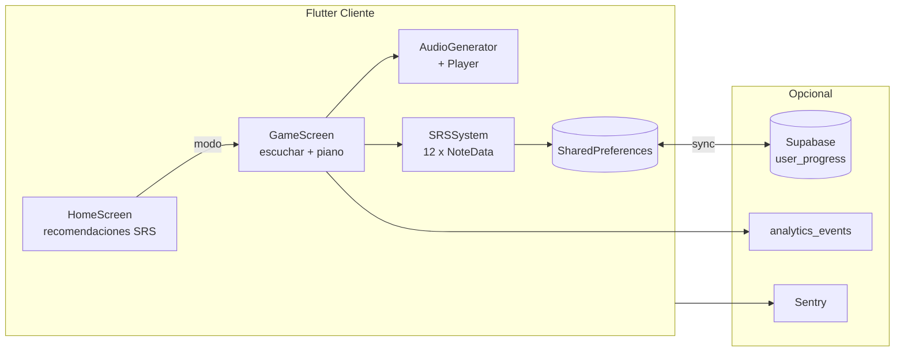
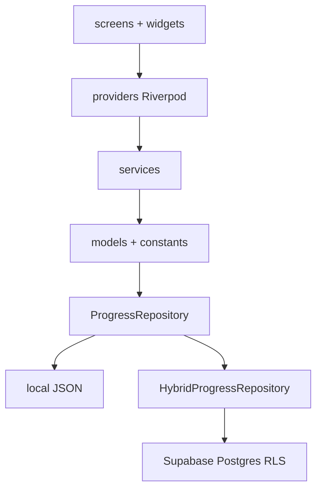

# TOGESC — System Design

**Producto:** Entrenador de Oído Absoluto  
**Nombre técnico:** TOGESC (TOne GEneration SCript)  
**Versión:** 1.0.0+1  
**Producción web:** https://togesc.vercel.app  
**Idioma UI:** español

---

## 1. Propósito

Aplicación multiplataforma en **Flutter** para entrenar el oído absoluto con:

- Repetición espaciada (SRS)
- Variación de octavas y timbres
- Limpieza tonal entre ejercicios

No es un quiz genérico de intervalos. Es un **motor de entrenamiento** con SRS adaptativo, cluster de limpieza y progresión pedagógica real (`Plan/project_context.txt`).

**Público:** personas que quieren adquirir oído absoluto, o mantener precisión, velocidad y generalización (timbres, octavas, contextos polifónicos).

**Modelo actual:** gratis para entrenar sin cuenta; sincronización en la nube y funciones Pro opcionales (Supabase + Stripe/RevenueCat).

---

## 2. Forma nativa del producto

El núcleo no es una pantalla estática: es un **bucle de ronda** sobre un **mapa SRS de 12 clases de altura**.

### 2.1 Estado por nota (`NoteData`)

Cada nota (C, C#, D … B) persiste:

| Campo | Rol |
|-------|-----|
| `weight` | Prioridad en selección (1.0–50.0, default 10.0) |
| `ease_factor` | SM-2 (1.3–2.5, default 2.5) |
| `consecutive_correct` | Aciertos seguidos; ≥ 5 → graduación |
| `times_seen` / `times_correct` | Estadísticas |
| `interval_index` | Posición en `[1, 3, 7, 14, 30, 60, 120]` días |
| `last_seen` / `next_review` | ISO timestamps |
| `is_learning` | Fase aprendizaje vs consolidación |

Archivo: `TOGESC/togesc/lib/models/note_data.dart`

### 2.2 Flujo de una ronda

```
idle → escuchar tono(s) → seleccionar notas (piano/texto) → confirmar →
resultado → cluster limpieza (~3 s) → idle → SRS actualizado
```

Estados de sesión (`GameState`): `idle`, `listening`, `waitingForAnswer`, `showingResult`, `playingCluster`.

Archivos: `lib/providers/game_session_provider.dart`, `lib/screens/game_screen.dart`

### 2.3 Reglas SRS críticas (`srs_constants.dart`)

- Respuesta rápida: **&lt; 2 s** (`fastResponseThreshold`) → mayor bonificación de peso
- Graduación: **5 aciertos consecutivos** (`learningPhaseThreshold`)
- Nota **vencida**: pasado 150 % del intervalo (`overdueThreshold`)
- Cluster post-ejercicio: **3 s**, 50 tonos, 100–4000 Hz (`audio_constants.dart`)

---

## 3. Modos de juego

Definidos en `GameMode` (`lib/constants/game_constants.dart`):

| ID | Nombre en UI | Notas | Plan |
|----|----------------|-------|------|
| 1 | Una sola nota | 1 | Free |
| 2 | Intervalo (2 notas) | 2 simultáneas | Free |
| 3 | Acorde (3 notas) | 3 simultáneas | Pro |
| 4 | Aleatorio (1-5 notas) | 1–5 | Pro |
| 5 | Solo sostenidos | C#, D#, F#, G#, A# | Free |
| 7 | Entrenamiento de velocidad | countdown adaptativo | Pro |

Velocidad: tiempo inicial 10 s, mín 3 s, máx 15 s; −1 s por acierto, +2 s por error.

Entrada: **piano táctil** (7 blancas + 5 negras) o **texto** (`parseNotes`: espacios, comas, guiones; bemoles → sostenidos; solfeo Do/Re/Mi opcional en `/account`).

---

## 4. Arquitectura

### 4.1 Capas Flutter (cliente único)

```
UI (screens + widgets)
     ↓
Providers (Riverpod) — sesión, sync, suscripción, analytics
     ↓
Services — SRS, audio, persistencia, sync, pagos
     ↓
Models + Constants
     ↓
ProgressRepository → local | híbrido | Supabase
```

**ADR clave** (`Plan/project_context.txt`):

- **ADR-001:** un solo codebase Flutter (móvil, web, escritorio)
- **ADR-003:** SRS, síntesis y validación **siempre en cliente**
- **ADR-004:** persistencia local obligatoria (offline-first)
- **ADR-006:** Supabase + RevenueCat + Stripe + Sentry para negocio y operación

### 4.2 Audio (latencia crítica)

| Componente | Archivo | Función |
|------------|---------|---------|
| Síntesis | `audio_generator.dart` | Aditiva, ADSR, 7 presets, pink noise, cluster |
| Playback nativo | `audio_player_service.dart` | `flutter_soloud`, buffers PCM |
| Playback web | `web_audio_playback_web.dart` | Web Audio API |
| Octavas | `getNoteFrequencies` | Base o ×2 (`minOctaveShift`–`maxOctaveShift`) |
| Sample rate | `audio_constants.dart` | 44100 Hz, duración nota 1.0 s |

### 4.3 Persistencia y sync

| Capa | Implementación |
|------|----------------|
| Local | `SharedPreferencesProgressRepository` → JSON en `progress.json` |
| Remoto | `SupabaseProgressRepository` → tabla `user_progress` |
| Híbrido | `HybridProgressRepository` — local primero, merge por `last_session`, cola `SyncPendingStore` |

Tabla `user_progress`: `user_id`, `progress` (jsonb), `last_session`, `updated_at`; RLS por `auth.uid()`.

### 4.4 Monetización (Fase 5)

| Canal | Tecnología | Estado en Supabase |
|-------|------------|-------------------|
| Web | Stripe Checkout + Portal | `user_subscriptions` + webhook `stripe-webhook` |
| iOS/Android | RevenueCat | webhook `revenuecat-webhook` |
| Entitlement | `pro` | `plan`, `status`, `trial_ends_at`, `expires_at` |

Trial: **14 días** (`SubscriptionConstants.trialDays`).  
Activación build: `MONETIZATION_ENABLED` + URLs Stripe vía `--dart-define`.

### 4.5 Observabilidad (Fase 6)

| Sistema | Destino | Config |
|---------|---------|--------|
| Crashes | Sentry | `SENTRY_DSN`, release `togesc@1.0.0`, env `production` |
| Producto | `analytics_events` | `app_open`, `mode_started`, `round_completed`, `paywall_viewed`, `csat_submitted`, `sync_completed` |
| Agregados | `metrics_daily`, `metrics_csat_daily` | SQL + `scripts/metrics-report.ps1` |
| Uptime | GitHub Actions `uptime-check.yml` | GET https://togesc.vercel.app |
| Backup DB | `supabase-backup.yml` | semanal |

---

## 5. Archivos críticos

### 5.1 Dominio pedagógico

| Archivo | Responsabilidad |
|---------|-----------------|
| `lib/services/srs_system.dart` | Algoritmo SRS híbrido (pesos + SM-2) |
| `lib/constants/srs_constants.dart` | Umbrales y intervalos |
| `lib/constants/notes.dart` | 12 clases de altura, enarmonías |
| `lib/services/note_parser.dart` | Normalización de respuestas |
| `lib/constants/note_naming.dart` | C/D/E ↔ Do/Re/Mi |

### 5.2 Sesión de juego

| Archivo | Responsabilidad |
|---------|-----------------|
| `lib/providers/game_session_provider.dart` | Orquestación de ronda + analytics |
| `lib/providers/speed_session_provider.dart` | Modo velocidad |
| `lib/screens/game_screen.dart` | UI ronda estándar |
| `lib/screens/speed_game_screen.dart` | UI velocidad |
| `lib/widgets/piano_keyboard.dart` | Entrada táctil |
| `lib/widgets/result_card.dart` | Feedback + cambios SRS |

### 5.3 Estado global y navegación

| Archivo | Responsabilidad |
|---------|-----------------|
| `lib/main.dart` | Bootstrap, Sentry, Supabase, listeners |
| `lib/app/router.dart` | GoRouter: `/`, `/game/:modeId`, `/account`, `/paywall`, … |
| `lib/providers/srs_provider.dart` | `SRSSystem` + persistencia |
| `lib/providers/sync_provider.dart` | `syncNow`, diagnóstico |
| `lib/providers/subscription_provider.dart` | Acceso Pro |

### 5.4 Infraestructura repo

| Ruta | Rol |
|------|-----|
| `Plan/project_context.txt` | Visión, ADRs, RN-001…007 |
| `Plan/plan_fases.txt` | Roadmap fases 0–6 |
| `supabase/migrations/` | Esquema Postgres + RLS |
| `supabase/functions/` | Webhooks Stripe/RevenueCat |
| `.github/workflows/ci.yml` | analyze + test |
| `.github/workflows/deploy-web.yml` | build web + Vercel |

---

## 6. Navegación (rutas reales)

| Ruta | Pantalla |
|------|----------|
| `/` | Home — modos + recomendaciones |
| `/onboarding` | Onboarding pedagógico (primera vez) |
| `/game/:modeId` | Juego por modo |
| `/speed` | Selector modo velocidad (Pro) |
| `/speed/game/:modeId` | Juego velocidad |
| `/statistics` | Estadísticas |
| `/account` | Cuenta, sync, preferencias (solfeo, recordatorios) |
| `/subscription` | Gestión suscripción |
| `/paywall` | TOGESC Pro |
| `/about` | Acerca de TOGESC |
| `/privacy` | Política de privacidad |

---

## 7. Identidad visual (código)

Definida en `lib/app/app_theme.dart` (Material 3):

| Token | Valor |
|-------|-------|
| Seed color | `#6A1B9A` (púrpura musical) |
| Cards | `borderRadius` 12, sin elevación, borde `outlineVariant` |
| Botones filled | mínimo **48×48 dp** |
| Tema | claro / oscuro (`ThemeMode.system`) |

Feedback piano (`piano_keyboard.dart`):

- Selección: `amber`
- Correcto: `green`
- Incorrecto: `red`

Modos en home usan acentos por tarjeta: verde (una nota), naranja (intervalo), `deepOrange` (acorde), púrpura (aleatorio), azul (sostenidos), rojo (velocidad).

Espaciado recurrente en pantallas: padding **16**; títulos sección **20** bold; gaps **12–16**.

---

## 8. Backend Supabase (proyecto `togesc`)

**Ref:** `puetlvcsrntwweuxinee`  
**URL:** `https://puetlvcsrntwweuxinee.supabase.co`

| Tabla / vista | Uso |
|---------------|-----|
| `user_progress` | JSON SRS por usuario |
| `user_subscriptions` | Cache entitlement Pro |
| `analytics_events` | Eventos de producto |
| `metrics_daily` | Agregado por día/evento |
| `metrics_csat_daily` | CSAT agregado |

Edge functions (JWT desactivado en webhook):

- `https://puetlvcsrntwweuxinee.supabase.co/functions/v1/stripe-webhook`
- `https://puetlvcsrntwweuxinee.supabase.co/functions/v1/revenuecat-webhook`

---

## 9. Objetivos por fase (estado)

| Fase | Objetivo | Estado |
|------|----------|--------|
| 0 | Repo solo Flutter | Completada |
| 1 | MVP pedagógico local | Completada |
| 2 | CI + deploy web | Completada |
| 3 | Web pública v1.0.0 | Completada |
| 4 | Cuentas + sync Supabase | Completada (código) |
| 5 | Freemium Stripe/RevenueCat | Completada (código); sandbox manual |
| 6 | Observabilidad, backup, CSAT | Completada |

**Pendiente operativo (no es Fase 7):**

- Validación manual sync web + móvil
- Sandbox pagos iOS/Android + Stripe test
- Stores móviles (AAB, TestFlight) — diferido Fase 3
- Modo micrófono / tarareo — diferido Fase 6 [C]

---

## 10. Diagramas

### 10.1 Bucle de entrenamiento (dominante)



### 10.2 Capas



---

## 11. Referencias

| Documento | Contenido |
|-----------|-----------|
| [Plan/gui_information_architecture.md](gui_information_architecture.md) | IA + inventario completo de vistas, diálogos y componentes GUI |
| [Plan/stitch_design_brief.md](stitch_design_brief.md) | Lista de pantallas para diseño en Stitch (contenido, sin prescripción visual) |
| [Plan/project_context.txt](project_context.txt) | ADRs, reglas de negocio, NFRs |
| [Plan/plan_fases.txt](plan_fases.txt) | Roadmap y DoD |
| [Plan/contexto.txt](contexto.txt) | Port histórico Python→Flutter, V-model tests |
| [docs/supabase_setup.md](../docs/supabase_setup.md) | Setup Supabase |
| [README.md](../README.md) | Inicio rápido y stack |

---

*Última revisión: alineado con `main` post Fase 6 (observabilidad, sync, monetización).*
